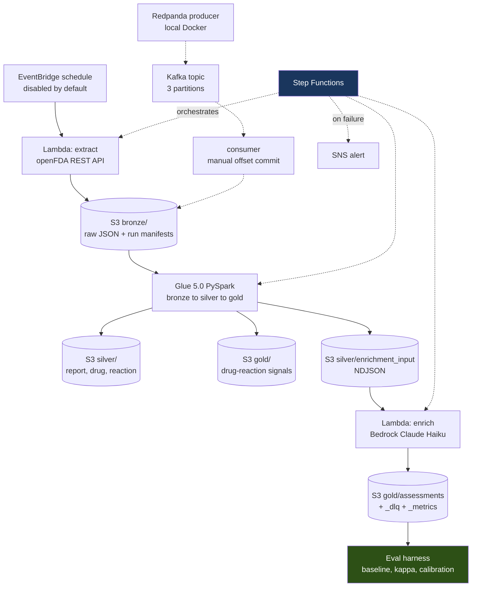

# AE-Signal

A serverless data pipeline on AWS that ingests FDA adverse event reports,
transforms them through a medallion architecture, enriches them with Amazon
Bedrock, and **scores that enrichment against ground truth**.

The last part is the point. Plenty of pipelines call an LLM. This one measures
whether the LLM output is worth anything, publishes the number next to the
baseline it has to beat, and reports honestly when the sample is too small to
draw a conclusion.

---

## Status

| Component | Status |
|---|---|
| Repo scaffold, Terraform backend, cost guardrails | Done |
| openFDA extractor — Lambda to S3 bronze | Done |
| Kafka-API streaming ingestion (Redpanda, local) | Done |
| Glue PySpark transform — bronze to silver to gold | Done |
| Bedrock enrichment with schema validation | Done |
| Eval harness with labeled ground truth | Done |
| Step Functions orchestration | Done |
| CI/CD — GitHub Actions with OIDC | Done |
| Architecture docs, cost analysis, results | Done |

104 tests, none of which touch AWS or the network.

---

## Architecture



Everything except the Redpanda path is deployed via Terraform and orchestrated
by Step Functions. See [docs/architecture.md](docs/architecture.md) for the
reasoning behind each layer.

---

## Results

From a deployed pipeline run, 20 reports:

| Metric | Value |
|---|---|
| Accuracy | 85.0% |
| **Majority-class baseline** | **70.0%** |
| **Lift over baseline** | **+15.0 pp** |
| Cohen's kappa | 0.625 |
| Precision / Recall | 86.7% / 92.9% |
| Specificity | 66.7% |
| Hallucination rate | 6.2% (1 of 16 named suspects) |
| p95 latency | 3,680 ms |

**The sample is too small to support the headline.** The 95% Wilson interval on
17/20 runs from roughly 64% to 95%, and the 70% baseline sits inside it. The
+15 point lift is three records. This result is directionally encouraging and
statistically indistinguishable from always predicting the majority class.

Specificity is the weak spot: four of six non-serious reports classified
correctly. The model over-predicts `serious`, which given a 70% base rate is
the direction that flatters the accuracy figure.

Full analysis, including calibration and what I would do next, in
[docs/eval.md](docs/eval.md).

### Transform throughput

20 bronze reports produce 20 report rows, 71 drug rows, 47 reaction rows, and
57 gold signal pairs. Drugs and reactions stay in separate tables rather than
being exploded together — a report with 8 drugs and 6 reactions would otherwise
become 48 rows and silently inflate every downstream count.

---

## What I would do differently at production scale

**Glue versus EMR.** Glue is serverless Spark with per-second billing and no
cluster to manage, which is right for intermittent batch work at this volume.
EMR wins when you run continuously enough to amortise a persistent cluster,
need specific Spark versions or custom JARs, or want fine-grained instance
control. The crossover is roughly when the cluster would be busy more than it
is idle.

**Redpanda versus MSK.** The streaming code is real Kafka client code against a
real broker, but the broker runs in Docker on a laptop. Production would need
MSK or self-managed Kafka, IAM or SASL auth, VPC networking, and the consumer
running as an ECS task rather than a local process. The client code would
largely survive; the operational surface would not.

**`coalesce(1)` does not scale.** Correct at 20 rows, wrong at 20 million — it
forces all output through a single writer. Production targets a file size
(128–512 MB) by computing partition count from row count, or leans on adaptive
query execution.

**Enrichment is sequential.** One Bedrock call at a time, ~2s each, capped at
50 records per run. At real volume this needs concurrency with a rate limiter,
or a switch to batch inference.

**The eval needs a bigger labeled set.** Nothing else here is worth tuning
until n is large enough to distinguish the model from the baseline. That means
200+ records, stratified to include more negatives, with confidence intervals
reported alongside every point estimate.

---

## Cost

Under $2 total across the entire build, including roughly eight Glue runs.
See [docs/cost.md](docs/cost.md) for the breakdown and the controls that keep
it there — budget alarms deployed before any billable resource, schedules
disabled by default, response caching, and hard record caps on every model call.

---

## Incidents

Eight documented failures with root cause and prevention, in
[docs/incidents.md](docs/incidents.md). Every one came from actually deploying
this rather than from a synthetic exercise. Three of them share a root:

**The same code means different things in different execution contexts.**
Relative imports resolve under `python -m` and fail under Glue's
`--extra-py-files`. `PYSPARK_PYTHON` is implicit in a venv and wrong on a
managed cluster. `SystemExit(0)` means success in a shell and failure inside
Glue's job wrapper. No test suite catches any of these, because tests run in
the local context by definition.

The most instructive one is [a fully successful Glue job reported as
FAILED](docs/incidents.md) — every output written correctly while the pipeline's
own monitoring said it had broken.

---

## Scope and limitations

Stated plainly so nothing here is oversold.

- **Streaming runs locally** via Redpanda in Docker. Not deployed to MSK.
- **Spark runs on Glue.** No EMR experience is claimed.
- **Single cloud.** No Azure components.
- **All data is public.** No PHI, and no HIPAA controls are implemented here.
- **The eval is underpowered** at n=20. See the interval above.
- **PRR is a screening heuristic**, not evidence of causation. Spontaneous
  reporting data has no denominator, no control group, and heavy reporting bias.
- **The Bedrock cost rates are configuration**, not measured against a bill.

---

## Running it

```bash
make install          # venv + dev dependencies
make test             # 104 tests, no AWS
make lint

./scripts/bootstrap-backend.sh    # one-time: Terraform state bucket
cp infra/terraform.tfvars.example infra/terraform.tfvars
make tf-init && make tf-plan && make tf-apply

make run-pipeline     # Step Functions, end to end
make pipeline-status

./scripts/empty-bucket.sh $(terraform -chdir=infra output -raw bronze_bucket)
make tf-destroy
```

Local development, no AWS:

```bash
python -m src.extract --start 2024-01-01 --end 2024-01-28
make transform-local
make up && make topic && make produce && make consume   # streaming slice
```

---

## Stack

Python 3.12 · PySpark on AWS Glue 5.0 · AWS Lambda · S3 · Step Functions ·
EventBridge · Amazon Bedrock (Claude Haiku) · Glue Data Catalog · CloudWatch ·
SNS · Kafka API via Redpanda · Terraform · GitHub Actions with OIDC · pytest ·
moto · ruff · black

## Documentation

- [Architecture](docs/architecture.md)
- [Evaluation results](docs/eval.md)
- [Streaming design and delivery semantics](docs/streaming.md)
- [CI/CD and OIDC](docs/cicd.md)
- [Cost](docs/cost.md)
- [Incidents](docs/incidents.md)
